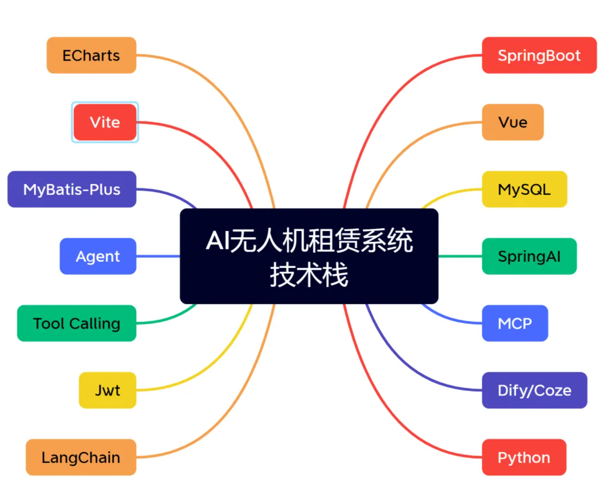
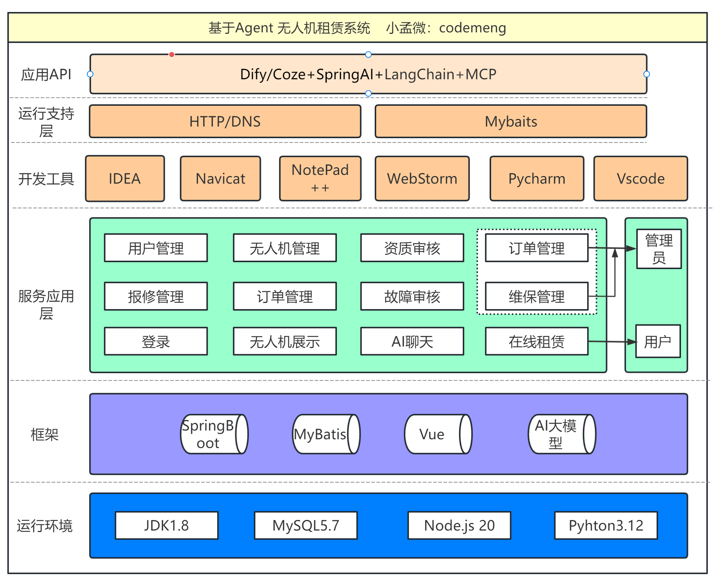
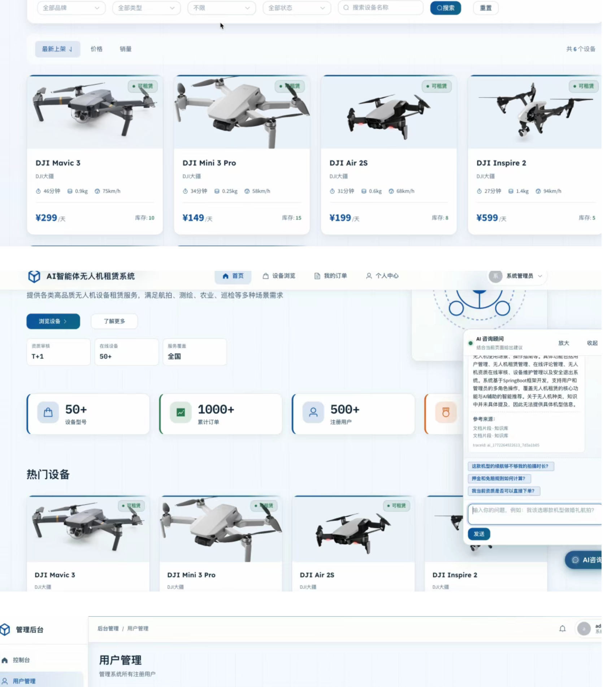
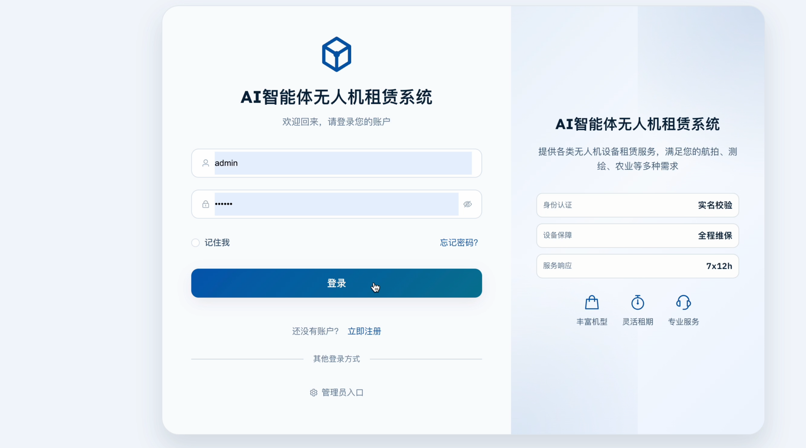
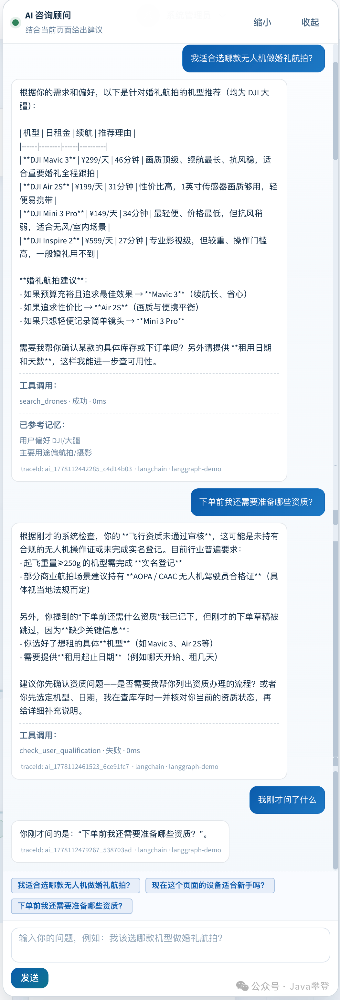

# 🚁 基于AI+Agent+Rag无人机设备器材租赁系统


<div align="center">


**一个面向租赁业务场景的 AI 无人机租赁平台，集成用户租赁、后台运营、资质审核、空域备案、故障报修与 AI 智能问答能力。**

</div>

---

## 📌 项目简介

本项目是一个适合毕业设计、课程设计、作品集展示和二次开发学习的全栈实战项目，围绕“无人机设备浏览、资质提交、下单租赁、支付管理、空域备案、归还结算、故障报修、后台审核、AI 咨询助手”构建完整业务闭环。

项目采用前后端分离架构：

- `backend`：Spring Boot 3 + MyBatis-Plus 后端服务
- `drone-rental-web`：Vue 3 + Vite + Element Plus 前端项目
- `ai-agent-service`：可选的 Python FastAPI + LangChain/LangGraph 智能体服务
- `sql`：数据库初始化脚本与 AI 扩展表脚本

项目技术架构图：



---

## ✨ 项目亮点

- 支持用户端与管理端双端场景，业务闭环完整
- 支持无人机租赁、支付、空域备案、故障报修、维修管理
- 支持用户飞行资质提交与后台审核
- 集成 AI 问答助手，可用于设备推荐、规则说明、订单解读
- 支持 Spring AI、MCP、RAGFlow、Dify、Coze 等扩展接入
- 提供可选 Python 智能体服务，便于做 AI 能力演示与教学拓展
- 代码结构清晰，适合学习全栈项目分层设计与工程化组织

---

## 🧩 项目功能

### 👤 用户端功能

- 用户注册、登录、个人中心
- 无人机列表浏览、筛选、详情查看
- 在线创建租赁订单
- 订单支付、订单查询、订单详情查看
- 用户资质上传与审核结果查看
- 空域备案提交与备案结果查询
- 故障报修提交
- 订单评价与互动
- AI 智能咨询助手

### 🛠️ 管理端功能

- 管理员登录
- 控制台数据总览
- 用户管理
- 用户资质审核
- 无人机设备管理
- 订单管理
- 故障报修审核
- 维修工单管理
- 评论与评价管理

### 🤖 AI 智能体能力

- 设备推荐与租赁规则问答
- 订单状态解读与流程说明
- 资质审核前置提醒
- 故障上报流程引导
- AI 记忆、调用日志、会话追踪
- 可通过 HTTP Tool / MCP 方式对外提供业务工具能力

---

## 🧱 技术介绍

### 🔙 后端技术栈

| 技术              | 版本            | 说明                       |
| ----------------- | --------------- | -------------------------- |
| Java              | 21              | 项目运行语言               |
| Spring Boot       | 3.5.13          | 后端核心框架               |
| Spring MVC        | Spring Boot Web | REST API 开发              |
| MyBatis-Plus      | 3.5.16          | ORM 与分页查询             |
| MySQL             | 8.0+            | 主数据库                   |
| Druid             | 1.2.28          | 数据库连接池               |
| JWT               | 0.12.6          | 登录鉴权                   |
| springdoc-openapi | 2.8.17          | Swagger / OpenAPI 文档     |
| Spring AI         | 1.1.5           | AI 对话、Tool Calling、MCP |
| Hutool            | 5.8.22          | 工具类库                   |
| Lombok            | -               | 简化 Java 模板代码         |

### 🖥️ 前端技术栈

| 技术         | 版本   | 说明               |
| ------------ | ------ | ------------------ |
| Vue          | 3.4.21 | 前端核心框架       |
| Vite         | 5.2.x  | 构建工具           |
| Element Plus | 2.6.1  | 管理端与业务组件库 |
| Pinia        | 2.1.7  | 状态管理           |
| Vue Router   | 4.3.0  | 路由管理           |
| Axios        | 1.6.8  | 请求封装           |
| ECharts      | 6.0.0  | 管理端图表展示     |
| Sass         | 1.72.0 | 样式预处理         |

### 🧠 AI 技术栈

| 技术                          | 说明                             |
| ----------------------------- | -------------------------------- |
| Spring AI                     | 主 AI 调用链路                   |
| OpenAI Compatible API         | 可接 OpenAI、DeepSeek 等兼容接口 |
| MCP                           | 对外暴露 AI 工具能力             |
| RAGFlow                       | 可选知识库问答与降级链路         |
| Dify / Coze                   | 可选外部工作流平台接入           |
| FastAPI + LangChain/LangGraph | 可选 Python 智能体服务           |

---

## 🏗️ 框架介绍

本项目采用经典的前后端分离设计，并在业务系统基础上扩展了 AI 能力接入层。

### 📦 后端框架

- 基于 `Spring Boot 3` 构建 RESTful API
- 通过 `MyBatis-Plus` 完成数据库访问与实体映射
- 使用 `JWT` 实现用户端和管理端认证鉴权
- 通过 `springdoc-openapi` 自动生成接口文档
- 使用 `Spring AI` 完成模型接入、工具调用与 AI 能力编排

### 🎨 前端框架

- 基于 `Vue 3 + Vite` 搭建 SPA 应用
- 使用 `Element Plus` 快速构建后台和业务界面
- 使用 `Pinia` 管理登录态、用户信息与权限数据
- 使用 `Vue Router` 区分用户端、管理端和认证页面

### 🔌 AI 扩展框架

- Java 主链路默认通过 `Spring AI` 工作
- 可选接入 `RAGFlow` 作为知识库与兜底问答能力
- 可通过 `MCP` 或 `HTTP Tool` 让外部 AI 平台调用业务工具
- 可选启用 `ai-agent-service`，以 Python 方式做 LangChain/LangGraph 演示

---

## 🏛️ 架构设计

### 🧭 系统架构



### 🧱 后端分层说明

- `controller`：接口层，负责接收请求与返回结果
- `service`：业务层，负责订单、设备、资质、维修、AI 对话等业务逻辑
- `mapper`：数据访问层，负责数据库读写
- `entity / dto / vo`：实体、传输对象与视图对象
- `security`：JWT、管理员权限与拦截逻辑
- `ai`：AI 模型接入、工具注册、记忆与日志追踪

### 🔄 核心业务流程

1. 用户注册登录后浏览无人机设备。
2. 用户提交飞行资质，等待后台审核。
3. 用户选择设备创建租赁订单并支付。
4. 用户在租赁过程中可查看订单状态、提交空域备案或报修。
5. 管理员在后台完成审核、发货、维修、评价管理等工作。
6. AI 助手贯穿设备咨询、下单引导、订单解释、报修帮助等场景。

---

## 📂 项目结构

```text
2-AI无人机租赁
├─ backend                    # Spring Boot 后端服务
│  ├─ src/main/java/com/drone/rental
│  │  ├─ ai                   # AI 相关能力
│  │  ├─ common               # 通用返回与工具类
│  │  ├─ config               # 配置类
│  │  ├─ controller           # 接口控制层
│  │  ├─ dto                  # 数据传输对象
│  │  ├─ entity               # 实体类
│  │  ├─ integration          # 外部集成
│  │  ├─ mapper               # MyBatis-Plus 映射
│  │  ├─ security             # 鉴权与权限控制
│  │  ├─ service              # 业务服务
│  │  ├─ util                 # 工具类
│  │  └─ vo                   # 视图对象
│  └─ uploads                 # 本地上传资源
├─ drone-rental-web           # Vue 前端项目
│  ├─ src/api                 # 前端接口封装
│  ├─ src/components          # 公共组件
│  ├─ src/layouts             # 布局组件
│  ├─ src/router              # 路由配置
│  ├─ src/stores              # Pinia 状态管理
│  └─ src/views               # 页面视图
├─ ai-agent-service           # 可选 Python AI Agent 服务
├─ sql                        # 数据库脚本
├─ docs                       # 技术文档与部署文档
└─ openspec                   # 变更与规范文档
```

---

## 🖼️ 项目截图

> 下方已预留截图插入位置，上传到 Gitee 前将图片放到如 `docs/images/` 目录，然后替换路径即可。

### 🏠 首页展示



### 👤 用户端页面



### 🛠️ 管理端页面


### 🤖 AI 助手页面-带上下文翻译和记忆功能



## 🚀 部署介绍

### 💻 环境要求

- JDK 21 及以上
- Maven 3.9 及以上
- Node.js 18 及以上
- npm 9 及以上
- MySQL 8.0 及以上
- 可选：Python 3.11+、`uv`、RAGFlow

### 🌐 端口规划建议

| 服务                       | 默认端口        | 说明                      |
| -------------------------- | --------------- | ------------------------- |
| 后端 `backend`             | `8080`          | 实际接口前缀为 `/api`     |
| 前端 `drone-rental-web`    | `5173`          | Vite 开发服务默认端口     |
| AI 服务 `ai-agent-service` | `8090`          | 可选 LangChain 服务       |
| MySQL                      | `3306` 或自定义 | 当前配置示例使用了 `5455` |

### ⚙️ 后端配置说明

后端主配置文件：

- `backend/src/main/resources/application.yml`

关键配置项包括：

- 服务端口：`server.port=8080`
- 接口前缀：`/api`
- 数据库连接：`spring.datasource.*`
- JWT 密钥：`jwt.secret`
- 文件上传目录：`file.upload-path=uploads/`
- AI 模型与 RAGFlow 配置：`ai.*`、`spring.ai.*`

### 🔐 环境变量说明

项目根目录已提供：

- `.env.example`
- `.env.deepseek.example`

其中常用变量如下：

| 变量名                        | 说明                       |
| ----------------------------- | -------------------------- |
| `AI_MODEL_ENABLED`            | 是否启用云模型             |
| `AI_MODEL_BASE_URL`           | OpenAI Compatible API 地址 |
| `AI_MODEL_API_KEY`            | 模型 API Key               |
| `AI_MODEL_CHAT_MODEL`         | 对话模型名称               |
| `AI_AGENT_MODE`               | `spring-ai` 或 `langchain` |
| `AI_AGENT_LANGCHAIN_BASE_URL` | Python Agent 地址          |
| `AI_RAGFLOW_BASE_URL`         | RAGFlow 地址               |
| `AI_MCP_SERVER_ENABLED`       | 是否启用 MCP               |
| `AI_MCP_API_KEY`              | MCP / HTTP Tool 鉴权密钥   |

---

## ▶️ 启动教程

### 1️⃣ 初始化数据库

先创建数据库，并执行 `sql/init.sql`：

```sql
CREATE DATABASE drone_rental DEFAULT CHARACTER SET utf8mb4 COLLATE utf8mb4_unicode_ci;
```

然后导入：

```bash
mysql -u root -p drone_rental < sql/init.sql
```

如果你要启用 AI 会话追踪、工具日志和记忆功能，再继续执行：

```bash
mysql -u root -p drone_rental < sql/ai_agent_tables.sql
```

### 2️⃣ 启动后端

```bash
cd backend
mvn clean package
java -jar target/drone-rental-1.0.0.jar
```

开发模式也可以直接运行：

```bash
cd backend
mvn spring-boot:run
```

启动后可访问：

- 后端接口基址：`http://localhost:8080/api`
- Swagger 文档：`http://localhost:8080/api/swagger-ui/index.html`

### 3️⃣ 启动前端

```bash
cd drone-rental-web
npm install
npm run dev
```

构建生产包：

```bash
cd drone-rental-web
npm run build
```

### 4️⃣ 启动可选 AI Agent 服务

仅在你需要使用 Python LangChain/LangGraph 方案时启用：

```bash
cd ai-agent-service
uv run uvicorn app.main:app --host 0.0.0.0 --port 8090
```

同时需要设置环境变量：

```bash
AI_AGENT_MODE=langchain
AI_AGENT_LANGCHAIN_BASE_URL=http://127.0.0.1:8090
```

🚀更详细的技术文档：


---

## 🗄️ SQL 介绍

### 📘 主数据库脚本

`sql/init.sql` 负责创建项目主业务表，核心内容包括：

| 表名                 | 说明             |
| -------------------- | ---------------- |
| `user`               | 用户表           |
| `user_qualification` | 用户飞行资质表   |
| `drone`              | 无人机设备表     |
| `drone_stock_log`    | 设备库存变动日志 |
| `airspace_record`    | 空域备案表       |
| `rental_order`       | 租赁订单表       |
| `payment`            | 支付记录表       |
| `comment`            | 评论评价表       |
| `fault_report`       | 故障报修表       |
| `maintenance_ticket` | 维修工单表       |
| `credit_record`      | 用户信用记录表   |

### 🧠 AI 扩展表脚本

`sql/ai_agent_tables.sql` 负责创建 AI 相关扩展表：

| 表名               | 说明              |
| ------------------ | ----------------- |
| `ai_chat_trace`    | AI 会话追踪表     |
| `ai_tool_call_log` | AI 工具调用日志表 |
| `ai_memory`        | AI 用户记忆表     |

### 🧪 初始化演示数据

`sql/init.sql` 中包含部分演示数据：

- 默认管理员账号：`admin`
- 默认测试用户：`testuser`
- 默认密码哈希对应常见初始密码 `123456`
- 预置若干无人机设备数据与空域备案示例数据

> 建议开源演示时保留示例数据，但在线部署到公网后务必第一时间修改默认账号密码。

---

## 🧭 页面与模块说明

### 🖥️ 前端页面

用户端主要页面：

- 首页 `Home`
- 无人机列表 `DroneList`
- 无人机详情 `DroneDetail`
- 我的订单 `MyOrders`
- 订单详情 `OrderDetail`
- 订单支付 `OrderPay`
- 个人中心 `Profile`
- 故障报修 `FaultReport`

管理端主要页面：

- 控制台 `Dashboard`
- 用户管理 `UserManagement`
- 资质审核 `AuditManagement`
- 无人机管理 `DroneManagement`
- 订单管理 `OrderManagement`
- 故障审核 `FaultAudit`
- 维修管理 `MaintenanceManagement`
- 评论管理 `CommentManagement`

### 🔌 后端接口模块

后端主要控制器模块：

- `AuthController`
- `UserController`
- `DroneController`
- `OrderController`
- `AirspaceController`
- `FaultController`
- `CommentController`
- `AiController`
- `AiMemoryController`
- `AiToolController`
- `Admin*Controller`

---

## 📚 文档资料

项目内还提供了较完整的补充文档，可继续深入学习：

- `docs/AI智能体无人机租赁系统-技术文档.md`
- `docs/技术方案.md`
- `docs/操作手册.md`
- `docs/ai/deployment-ai.md`
- `docs/ai/ragflow-deploy.md`
- `docs/ai/dify-tools.md`
- `docs/ai/coze-tools.md`

---

## 🧪 开源学习建议

如果你准备把项目发布到 Gitee，建议同步补充以下内容：

- 项目演示截图
- 演示视频链接
- 一键部署说明
- 许可证文件 `LICENSE`
- 常见问题 `FAQ`
- 接口测试截图或 Swagger 截图

这样仓库展示效果会更完整，也更适合其他人学习和复现。

---

## 📄 License

本项目适合用于学习交流、项目面试，课程设计、毕业设计参考与功能扩展。禁止商用，需要找小孟授权。

❤️star支持，更详细的资料和更详细的文档不断更新中。

---

## ❤️ 致谢

感谢以下开源技术生态：

- [www.javaclimb.com](http://www.javaclimb.com)
- [www.pdxmw.com](http://www.pdxmw.com)
- 程序员小孟
- 王铭浩

---

<div align="center">


**如果这个项目对你有帮助，欢迎在 Gitee 点个 Star。这是对我最大支持。**

</div>